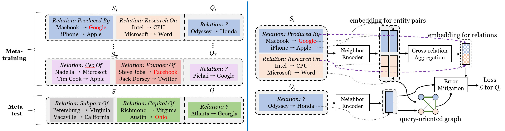
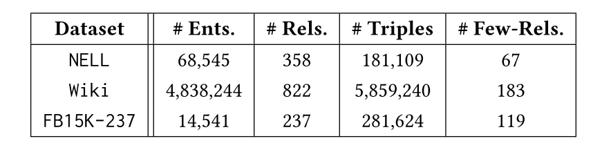

# REFORM

This is the code for the paper REFORM: Error-Aware Few-Shot Knowledge Graph Completion, CIKM 2021. [PDF file](https://songw-sw.github.io/REFORM.pdf)  
The citation is currently unavailable and we will update this page when the paper is finally published.

These are the statistics of the datasets:

	

To run the code, type the following commands:  

tar zxvf FB_data.tar.gz  
python train.py  

